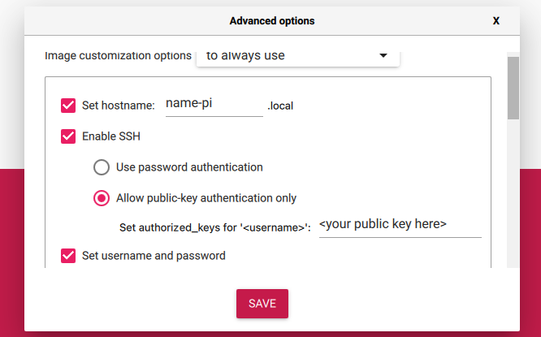
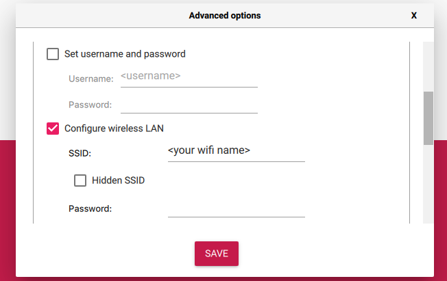

# Raspberry Pi Deployment Script
This script logs in to a Raspberry Pi server, copies necessary files using Rsync, executes an install script, and SSH's into the server.

## Usage
Clone this repository to your local machine.
Generate SSH keys in the nameless directory by running:
`ssh-keygen -t ed25519 -f ./id_ed25519`
Insert SD card on local machine.
Open Raspberry Pi Imager

Select Choose OS -> Other General Purpose OS -> Ubuntu -> Ubuntu Server 64 bit
Choose Storage -> Select SD card
Open Pi settings on MacOS: `Shift + Command + x`

Set Hostname: <name-pi>.local
Enable SSH: Allow public-key auth only -> Copy local id_ed25519.pub key to Set authorized_keys for:

Enable "Set username and password": Add username -> Deselect "Set username and password"

Select Configure wireless LAN: Add SSID ( Service Set Identifier ): the unique identifier that is assigned to you wifi. Aka wifi name.
Add Wifi Password
Set you local time zone settings.
Click Save.
Click Write to image the SD card.
When writing is complete, insert SD card into Raspbery Pi.
Run the script using the following command:
```shell
bash pi_deploy.sh
```

## Requirements
Raspberry Pi.
Raspberry Pi-Imager installed on the local machine.
SD card for imaging.
Bash version 4 or later.
Dig ( Domain information groper ) installed on the local machine.
Rsync installed on the local machine.


