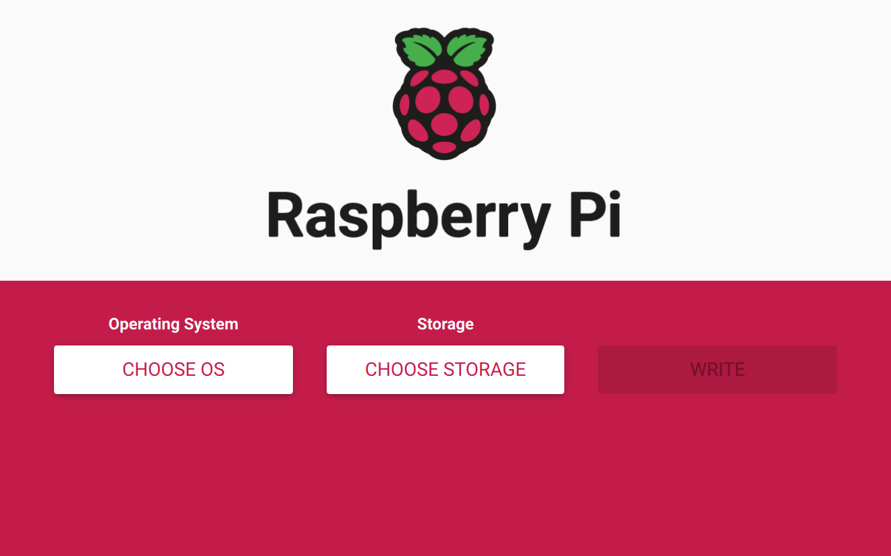
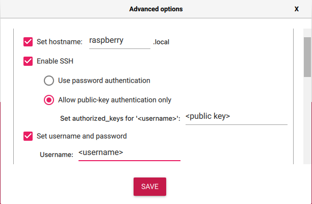
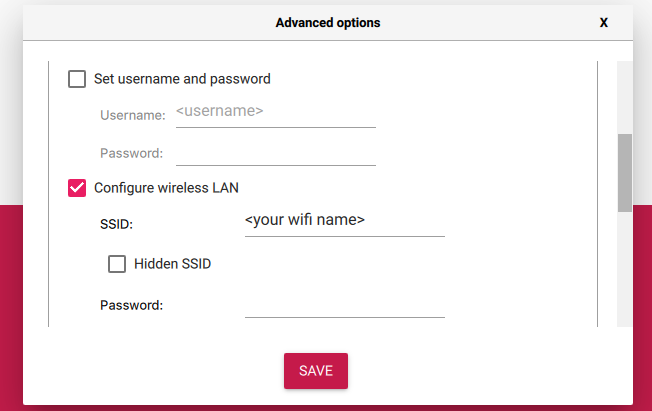

# Raspberry Pi Deployment Script
This script logs in to a Raspberry Pi server, copies necessary files using Rsync, executes an install script, and SSH's into the server.

## Usage
Clone this repository to your local machine.

Generate SSH keys in the nameless directory by running this command:
```bash
ssh-keygen -t ed25519 -f ./id_ed25519
```

Insert SD card on local machine.

Open Raspberry Pi Imager application.



* Select Choose OS &rarr; Other General Purpose OS &rarr; Ubuntu &rarr; Ubuntu Server 64 bit

* Choose Storage &rarr; Select SD card

* Open Pi Advanced Options: `Shift + Command + x`



* Set Hostname: raspberry.local

* Enable SSH: Allow public-key auth only &rarr; Copy local id_ed25519.pub key to Set authorized_keys for:

* Enable "Set username and password": Add username &rarr; Deselect "Set username and password"



* Select Configure wireless LAN: Add SSID ( Service Set Identifier ): the unique identifier that is assigned to you wifi. Aka wifi name.
* Add Wifi Password
* Set you local time zone settings.
* Click Save.
* Click Write to image the SD card.
* When writing is complete, insert SD card into Raspberry Pi.
* Power up Rasberry Pi

Run the script using the following command:
```shell
bash pi_deploy.sh
```

## Requirements
* Raspberry Pi.
* Raspberry Pi-Imager installed on the local machine.
* SD card for imaging.
* Rsync installed on the local machine.


